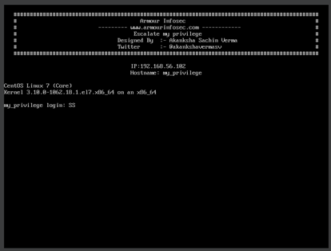
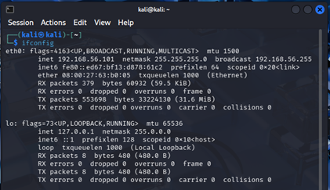
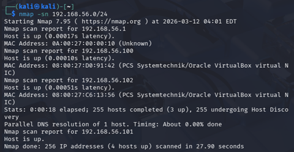
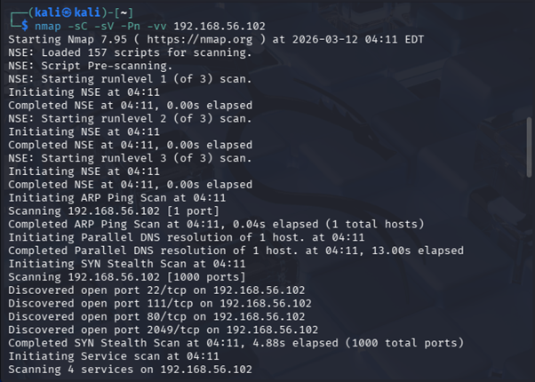
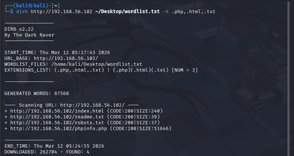
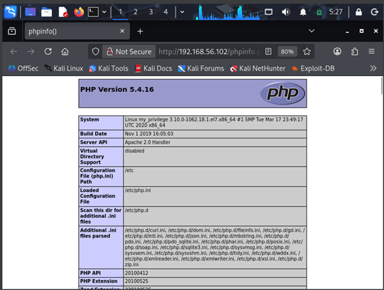
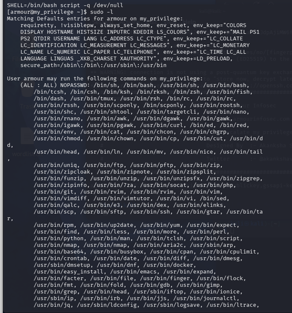
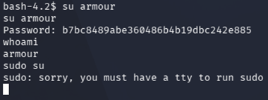
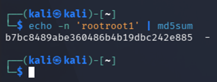
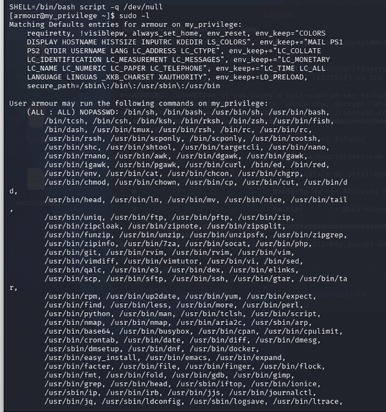

# Armour Infosec Privilege Escalation Lab

This project demonstrates the penetration testing process on the Armour Infosec VM.

## Objective

* Discover target machine
* Enumerate services
* Exploit web vulnerabilities
* Gain user access
* Perform privilege escalation to root

---

# 1 Network Scanning

Tool used: netdiscover

Command:

```
netdiscover
```

Result:
Discovered target IP: **192.168.56.102**

Screenshot:



---

# 2 Interface Configuration

Command:

```
ifconfig
```

Screenshot:



---

# 3 Port Scanning

Command:

```
nmap -sP 192.168.56.0/24
```

Result:
Target host discovered.

Screenshot:



---

# 4 Service Enumeration

Command:

```
nmap -sV -p- 192.168.56.102
```

Open Ports:

* 80 - HTTP
* 111 - RPCBind
* 2049 - NFS

Screenshot:



---

# 5 Web Directory Enumeration

Tool: DIRB

Command:

```
dirb http://192.168.56.102
```

Found directories:

* index.html
* robots.txt
* phpinfo.php

Screenshot:



---

# 6 Information Disclosure

Accessed:

```
http://192.168.56.102/phpinfo.php
```

Information gathered:

* PHP Version
* Server configuration

Screenshot:



---

# 7 Reverse Shell

Command used to gain shell access.

Screenshot:



---

# 8 User Access

User discovered:

```
armour
```

Screenshot:



---

# 9 Password Hash

Hash discovered:

```
b7bc8489abe360486b4b19dbc242e885
```

MD5 cracked password:

```
root1
```

Screenshot:



---

# 10 Privilege Escalation

Command:

```
sudo bash
```

Result:
Root access obtained.

Screenshot:



---

# Final Proof

Proof file:

```
cat /root/proof.txt
```

Result:

```
Best of Luck
628433556e49f976bab2cc04948a22fe4
```

---
